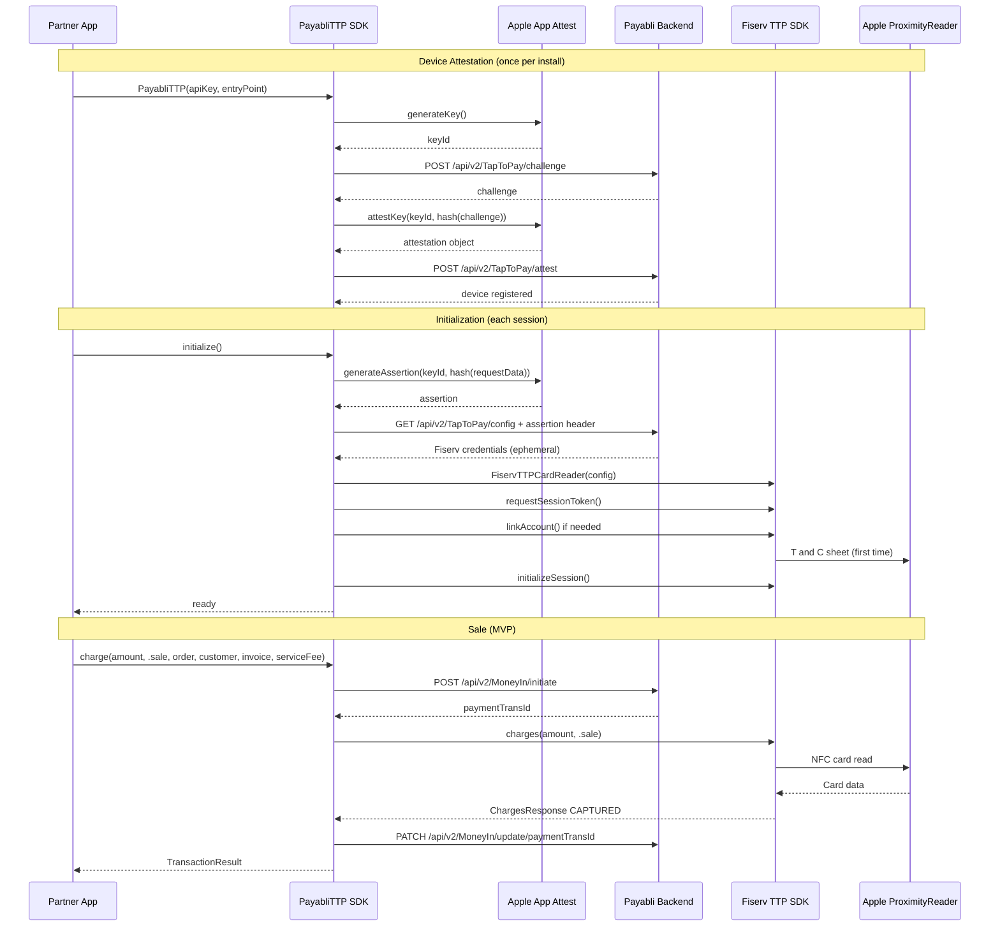

# PayabliTTP SDK -- MVP

## Context

Payabli operates as a **PSP (Payment Service Provider)** that uses Fiserv as the underlying processor. Partners integrate the PayabliTTP SDK into their apps to accept Tap to Pay payments. The SDK completely abstracts Fiserv -- partners never know Fiserv exists.

Reference implementations: [Stripe Terminal iOS SDK](https://github.com/stripe/stripe-terminal-ios), [Adyen POS Mobile SDK](https://docs.adyen.com/point-of-sale/ipp-mobile/tap-to-pay/).

## MVP Scope

- `initialize()` -- device attestation, fetch Fiserv credentials, set up NFC session
- `charge(.sale)` -- orchestrated sale with NFC card tap (initiate -> Fiserv -> update)

**Out of scope (next phases):**

- Phase 2 (NFC operations): `charge(.auth)`, `refund(.unmatched)`, `refund(.open)`
- Not SDK scope (partners call Payabli Cloud API directly): `charge(.capture)`, `charge(.paymentToken)`, `refund(.matched)`, `cancel()`, `voidTransaction()`

## Architecture




## Consumer API (what partners see)

```swift
// 1. Initialize
let payabli = PayabliTTP(
    apiKey: "pk_live_xxx",
    entry: "entry3715",
    deviceId: "dev_abc123",    // pre-registered by merchant in Payabli dashboard
    environment: .production,  // .qa / .sandbox / .production
    logLevel: .info            // .none / .error / .info / .debug
)
try await payabli.initialize()

// 2. Observe state
payabli.isReady           // @Published Bool
payabli.sessionState      // @Published SessionState

// 3. Sale with NFC tap
let result = try await payabli.charge(
    amount: 25.00,
    type: .sale,
    order: OrderDetails(orderId: "123", description: "Coffee"),
    customer: CustomerData(firstName: "John", lastName: "Doe"),
    invoice: InvoiceData(invoiceNumber: "INV-001", items: [
        LineItem(name: "Espresso", amount: 5.00, quantity: 2),
        LineItem(name: "Muffin", amount: 15.00, quantity: 1)
    ]),
    serviceFee: 1.50
)
```

## Project Structure

```
PayabliTTP/
├── Package.swift                                   # FiservTTP dependency, iOS 16.7+
├── Sources/PayabliTTP/
│   ├── PayabliTTP.swift                            # Public facade (Composition Root)
│   ├── Core/
│   │   ├── Configuration/
│   │   │   ├── PayabliTTPConfiguration.swift       # apiKey + entry + deviceId + environment
│   │   │   └── PayabliTTPEnvironment.swift         # .qa / .sandbox / .production
│   │   ├── Errors/
│   │   │   └── PayabliTTPError.swift               # Unified error type (LocalizedError)
│   │   ├── Events/
│   │   │   ├── EventStream.swift                   # AsyncStream-based event bus
│   │   │   └── PayabliTTPEvent.swift               # Domain events enum (Sendable)
│   │   ├── Logging/
│   │   │   └── Logger.swift                        # os.Logger wrapper, per-module categories
│   │   ├── Networking/
│   │   │   ├── Endpoints.swift                     # All API endpoint definitions
│   │   │   └── HTTPClient.swift                    # Adapter: URLSession -> Networking port
│   │   └── Ports/                                  # Hexagonal Architecture ports (protocols)
│   │       ├── CardReading.swift
│   │       ├── DeviceAttesting.swift
│   │       ├── Networking.swift
│   │       └── SecureStorage.swift
│   ├── Attestation/                                # Domain: device security
│   │   ├── AttestationService.swift                # challenge + attest + config API calls
│   │   ├── AttestationState.swift                  # .notRegistered / .registered / .unsupported
│   │   ├── DeviceAttestManager.swift               # Adapter: DCAppAttestService -> DeviceAttesting
│   │   ├── KeychainHelper.swift                    # Adapter: Security framework -> SecureStorage
│   │   └── Models/
│   │       ├── AttestRequest.swift
│   │       ├── ChallengeResponse.swift
│   │       └── ConfigResponse.swift
│   ├── CardReader/                                 # Domain: NFC card reader
│   │   └── FiservCardReader.swift                  # Adapter: FiservTTPCardReader -> CardReading
│   ├── Session/                                    # Domain: SDK lifecycle
│   │   ├── SessionManager.swift                    # Phase A->B->C orchestration + reinit
│   │   └── SessionState.swift                      # Formal state machine (FSM)
│   ├── Payment/                                    # Domain: payment orchestration
│   │   ├── PaymentOrchestrator.swift               # initiate -> NFC -> update flow
│   │   ├── PendingUpdateQueue.swift                # Persistent retry queue (UserDefaults)
│   │   ├── RetryPolicy.swift                       # Exponential backoff + jitter
│   │   ├── TransactionService.swift                # initiate + update API calls
│   │   └── Models/
│   │       ├── InitiateRequest.swift
│   │       ├── TransactionResponse.swift
│   │       └── UpdateRequest.swift
│   └── Models/                                     # Public domain models
│       ├── CustomerData.swift
│       ├── InvoiceData.swift
│       ├── LineItem.swift
│       ├── OrderDetails.swift
│       ├── PaymentType.swift                       # .sale (MVP); .auth in Phase 2
│       └── TransactionResult.swift                 # includes SyncStatus
└── Tests/PayabliTTPTests/
    ├── Mocks/
    │   ├── MockCardReader.swift                    # CardReading mock
    │   ├── MockDeviceAttester.swift                # DeviceAttesting mock
    │   ├── MockNetworking.swift                    # Networking mock
    │   ├── MockSecureStorage.swift                 # SecureStorage mock
    │   └── TestFixtures.swift                      # JSON response builders
    ├── PayabliTTPTests.swift                       # Configuration + Error + SecureStorage tests
    ├── PaymentOrchestratorTests.swift
    ├── PendingUpdateQueueTests.swift
    ├── RetryPolicyTests.swift
    ├── SessionManagerTests.swift
    └── SessionStateTests.swift
```

## Backend Endpoints

### New endpoints (need to be created)

**Challenge (iOS App Attest only, not used by Android):**

```
POST /api/v2/TapToPay/challenge
Headers: apiKey: <partner-api-key>
Response: { "challenge": "<random-nonce-base64>" }
```

**Register device attestation (iOS App Attest only, not used by Android):**

```
POST /api/v2/TapToPay/attest
Headers: apiKey: <partner-api-key>
Body: { "keyId": "...", "attestation": "<base64>" }
Response: 200 OK
```

**Fetch Fiserv config (cross-platform, verifies device integrity):**

```
GET /api/v2/TapToPay/config
Headers:
  apiKey: <partner-api-key>

  -- iOS (App Attest assertion):
  X-App-Assertion: <base64-assertion>
  X-App-KeyId: <key-id>

  -- Android (Play Integrity token):
  X-Play-Integrity-Token: <integrity-token>

Query: entryPoint=<entry-point-id>
Response: {
  "fiserv": {
    "secretKey": "...", "apiKey": "...", "environment": "...",
    "merchantId": "...", "appleTtpMerchantId": "...",
    "merchantName": "...", "merchantCategoryCode": "...",
    "terminalId": "...", "terminalProfileId": "...",
    "currencyCode": "USD"
  },
  "requestToken": "..."
}
```

Backend detects platform by which header is present and runs the corresponding verification flow. See "Device Attestation (Cross-Platform)" section for details.

### Existing endpoints (used by SDK)

- `POST /api/v2/MoneyIn/initiate` -- creates transaction record, returns paymentTransId
- `PATCH /api/v2/MoneyIn/update/{paymentTransId}` -- receives Fiserv response

## Device Attestation (Cross-Platform)

The backend is designed from the start to support both iOS and Android attestation. The SDK uses the platform-native mechanism; the backend detects the platform and verifies accordingly.

### iOS: Apple App Attest

**Phase A -- One-time registration (per install):**

1. `DCAppAttestService.shared.generateKey()` -- EC P-256 key in Secure Enclave, returns `keyId`
2. `POST /api/v2/TapToPay/challenge` -- get random nonce from backend
3. `attestKey(keyId, clientDataHash: SHA256(challenge))` -- Apple signs attestation
4. `POST /api/v2/TapToPay/attest` -- backend verifies with Apple Root CA, stores public key
5. Persist `keyId` in Keychain

**Phase B -- Every session (assertion):**

1. Build request data and hash: `SHA256({"action":"getConfig","entryPoint":"..."})`
2. `generateAssertion(keyId, clientDataHash)` -- Secure Enclave signs with counter
3. `GET /api/v2/TapToPay/config` with `X-App-Assertion` + `X-App-KeyId` headers
4. Backend verifies signature + counter, returns Fiserv credentials

Assertions do NOT use a server challenge. The counter provides replay protection -- each assertion increments it, making captured assertions invalid. This saves one HTTP round-trip per session.

**Key invalidation (triggers re-attestation):**

- App reinstalled
- Device migrated or restored from backup
- Backend returns unknown keyId error

### Android: Google Play Integrity 

Play Integrity works differently from App Attest -- there is no persistent key or registration step. Each request produces a single-use integrity token that the backend sends to Google for verification.

**No registration step.** Unlike iOS, there is no `challenge` or `attest` call. The Play Integrity API handles device/app verification internally.

**Every session:**

1. `StandardIntegrityManager.prepareIntegrityToken()` -- warm up (a few seconds)
2. `requestIntegrityToken(requestHash)` -- produces a signed, single-use token containing device integrity, app integrity, and account details
3. `GET /api/v2/TapToPay/config` with `X-Play-Integrity-Token` header
4. Backend sends the token to `playintegrity.googleapis.com/v1` to decode and verify
5. Backend checks verdicts (`MEETS_DEVICE_INTEGRITY`, `appRecognitionVerdict: PLAY_RECOGNIZED`), returns Fiserv credentials

**Key differences from iOS:**

- No `keyId`, no persistent key, no counter -- each request is independently verified via Google
- No `POST /challenge` or `POST /attest` endpoints needed
- Backend verifies by calling Google's API (server-to-server), not by checking a signature locally
- Replay protection is built-in -- tokens are single-use and bound to `requestHash`

### Platform Detection on Backend

The `GET /api/v2/TapToPay/config` endpoint detects the platform by which header is present:

- `X-App-Assertion` + `X-App-KeyId` present -> iOS App Attest verification flow
- `X-Play-Integrity-Token` present -> Android Play Integrity verification flow
- Neither present -> 401 Unauthorized

## `initialize()` Internal Flow

**Phase A -- Attestation (first install only):**
If no `keyId` in Keychain, runs full attestation flow (steps 1-5 above).

**Phase B -- Fetch credentials (every session):**
Generates assertion, calls `GET /config`, receives ephemeral Fiserv credentials (held in memory only, never persisted).

**Phase C -- Fiserv session (every session):**

1. `FiservTTPCardReader(config)` -- instantiate reader
2. `requestSessionToken()` -- get Fiserv session token
3. `isAccountLinked()` / `linkAccount()` -- Apple T&C (first time per Apple ID)
4. `initializeSession()` -- activate NFC session

State transitions: `.attestingDevice` -> `.fetchingConfig` -> `.initializingSession` -> `.ready`

## `charge(.sale)` Internal Flow

1. **Initiate** -- `POST /api/v2/MoneyIn/initiate` with entryPoint, paymentDetails (totalAmount, serviceFee), paymentMethod (method: "cloud", device: deviceId), customerData, invoiceData. Returns `paymentTransId`.
2. **Fiserv charge** -- `fiservTTPCardReader.charges(amount, .sale)` with merchantOrderId = paymentTransId, captureFlag = true. Triggers NFC tap UI. Returns `ChargesResponse` with transactionState "CAPTURED".
3. **Update** -- `PATCH /api/v2/MoneyIn/update/{paymentTransId}` with full Fiserv response (or error if charge failed).

## `reinitializeIfNeeded()` Internal Flow

Checks the ProximityReader session state and re-activates if needed. This method is both internal and public:

- **Internal:** The SDK calls it automatically at the start of every `charge()`. If the session expired (app was backgrounded, device locked), it re-establishes it before proceeding. Partners who never call it explicitly will still have working charges -- with ~1-2s extra latency on the first call after backgrounding.
- **Public:** Partners can call it proactively (e.g. in `scenePhase` handler on `.active`, or `onAppear` of the payment screen) to pre-warm the session so `charge()` starts instantly.

Steps:

1. Check if session is still active via Fiserv's `sessionReadySubject` (Combine publisher tracking ProximityReader state)
2. If expired: call `fiservTTPCardReader.initializeSession()` to re-activate NFC
3. If still active: no-op
4. Retry any pending updates from the `PendingUpdateQueue`

No NFC UI is shown -- this only re-establishes session readiness.

## Error Recovery

### Retry Policy

- `POST /challenge`, `POST /attest`, `GET /config`: retry 3x with exponential backoff (1s, 2s, 4s)
- `requestSessionToken()`, `initializeSession()`: retry 2x
- `POST /initiate`: retry 3x with backoff
- Fiserv `charges()`: NO retry (NFC not idempotent). Call update with error.
- `PATCH /update`: see critical path below

### Critical: Update Fails After Successful Fiserv Charge

1. Retry `PATCH /update` up to 5x with backoff (1s, 2s, 4s, 8s, 16s)
2. If all fail, persist payload to local storage as "pending update"
3. On next `initialize()` or `reinitializeIfNeeded()`, retry pending updates
4. `TransactionResult.syncStatus` returns `.synced` or `.pendingSyncWithBackend`
5. Partner can check `payabli.pendingUpdates` for unsynced transactions
6. Backend safety net: worker job polls Fiserv for initiated-but-not-updated transactions

### NFC Session Expiry

The SDK calls `reinitializeIfNeeded()` at the start of every `charge()`, so most session expiry cases are handled before the Fiserv call. If the session still expires mid-operation (between initiate and Fiserv charge):

1. Catch session error
2. Call `initializeSession()` to re-establish
3. Retry Fiserv charge once
4. If retry fails, call update with error and throw to partner

## Logging

Uses `os.Logger` with subsystem `"com.payabli.ttp"`. Categories per module: `"session"`, `"attest"`, `"charge"`, `"network"`.

- `.none`: nothing (production default)
- `.error`: failed API calls, Fiserv errors, attestation failures
- `.info`: + lifecycle events, transaction start/end, session state changes
- `.debug`: + request/response bodies (with redacted secrets), retry attempts, NFC events

Redaction: Fiserv secretKey/apiKey NEVER logged. Card data NEVER logged. requestToken truncated to first 8 chars.

## Security Model

- Partner only embeds Payabli `apiKey` (safe to expose, like Stripe publishable key)
- Fiserv credentials fetched per-session, held in memory only
- Device attestation required before backend returns credentials: iOS uses App Attest (Secure Enclave), Android uses Play Integrity (Google-verified)
- All communication over HTTPS
- Backend is platform-aware: detects iOS vs Android via request headers and runs the corresponding verification

## Backend Verification Guide (for .NET team)

The backend must support two verification paths. It detects the platform by inspecting request headers on `GET /config`.

### iOS: Verifying Attestation (`POST /attest`)

Attestation object is CBOR-encoded. Use `PeterO.Cbor` or `System.Formats.Cbor` (.NET 8+).

Steps:

1. Decode CBOR
2. Extract authData: RP ID hash (32 bytes), counter (must be 0), aaguid, credentialId (must match keyId)
3. Verify x5c certificate chain against [Apple App Attestation Root CA](https://www.apple.com/certificateauthority/private/)
4. Verify RP ID = SHA256("TEAM_ID.BUNDLE_ID")
5. Compute nonce = SHA256(authData + SHA256(challenge)), verify OID 1.2.840.113635.100.8.2
6. Verify credentialId = SHA256(public_key in X9.62 format)
7. Store public key in database (see schema below)

### iOS: Verifying Assertions (`GET /config` with App Attest)

1. Look up stored public key by X-App-KeyId + apiKey
2. Reconstruct clientDataHash from request parameters
3. Compute nonce = SHA256(authenticatorData + clientDataHash)
4. Verify EC P-256 signature with stored public key
5. Verify RP ID hash matches SHA256(APP_ID)
6. Verify counter is strictly greater than stored counter, then update it
7. Return Fiserv credentials only if all checks pass

### Android: Verifying Play Integrity Token (`GET /config` with Play Integrity)

Reference: [Google Play Integrity API - About integrity verdicts](https://developer.android.com/google/play/integrity/verdicts)

Steps:

1. Extract the `X-Play-Integrity-Token` header
2. Call Google's decryption API: `POST https://playintegrity.googleapis.com/v1/{packageName}:decodeIntegrityToken` with the token. Requires a Google Cloud service account with Play Integrity API access.
3. Google returns a decoded verdict (example below)
4. Verify `requestHash` -- the SDK sets this to the hash of `{"action":"getConfig","entryPoint":"..."}`. Backend reconstructs and compares.
5. Verify `appRecognitionVerdict` -- must be `PLAY_RECOGNIZED` (unmodified binary from Play Store)
6. Verify `deviceRecognitionVerdict` -- must include `MEETS_DEVICE_INTEGRITY` (genuine device, not emulator/rooted)
7. Verify `requestPackageName` -- must match the partner's registered Android package
8. Verify `timestampMillis` -- must be recent (within last 60 seconds) to prevent token reuse
9. Return Fiserv credentials only if all checks pass

**Example decoded verdict (step 3):**

```json
{
  "requestDetails": {
    "requestPackageName": "com.partner.app",
    "requestHash": "...",
    "timestampMillis": "..."
  },
  "appIntegrity": {
    "appRecognitionVerdict": "PLAY_RECOGNIZED"
  },
  "deviceIntegrity": {
    "deviceRecognitionVerdict": ["MEETS_DEVICE_INTEGRITY"]
  },
  "accountDetails": {
    "appLicensingVerdict": "LICENSED"
  }
}
```

### Database Schema (cross-platform)

```
Table: DeviceAttestations
- id (PK)
- apiKey (FK to partner)
- platform (enum: "ios" | "android")
- keyId (string, iOS only -- null for Android)
- publicKey (bytes, iOS only -- null for Android)
- receipt (bytes, iOS only -- for Apple fraud metrics)
- counter (int, iOS only -- starts at 0)
- deviceId (string, SDK-generated UUID)
- environment (sandbox/production)
- createdAt (timestamp)
- lastSeenAt (timestamp)
```

For Android, Play Integrity has no persistent key, so `keyId`, `publicKey`, `receipt`, and `counter` are null. Each request is independently verified via Google. The row still exists to associate `deviceId` with the partner for transaction tracking.

### .NET Libraries

**iOS verification:**

- CBOR: `PeterO.Cbor` or `System.Formats.Cbor` (.NET 8+)
- Certificates: `System.Security.Cryptography.X509Certificates`
- EC signatures: `System.Security.Cryptography.ECDsa` (P-256)
- ASN.1: `System.Formats.Asn1` (.NET 8+)

**Android verification:**

- HTTP client to call `playintegrity.googleapis.com` (built-in `HttpClient`)
- Google auth: `Google.Apis.Auth` (NuGet) for service account credentials
- JSON: `System.Text.Json` (built-in)

## Apple Tap to Pay Entitlement -- Partner Guide

### Phase 1 (Current): Partners list "Carat from Fiserv" as PSP

Payabli is not yet registered as PSP with Apple. Partners reference "Carat from Fiserv" when requesting the entitlement.

### Steps

1. Go to developer.apple.com/contact/request/tap-to-pay-on-iphone/
2. PSP: "Carat from Fiserv" (Phase 1) or "Payabli" (Phase 2)
3. Apple approves (1-2 business days)
4. Configure App ID: Identifiers > Additional Capabilities > Tap to Pay on iPhone
5. Add entitlement: `com.apple.developer.proximity-reader.payment.acceptance` = true
6. For TestFlight/App Store: request distribution entitlement from Apple

## Applied Design Patterns

### Architecture

**Hexagonal Architecture (Ports & Adapters)**
The entire SDK is structured around protocol-defined ports and concrete adapters. This decouples the domain logic from all external systems (Fiserv SDK, Keychain, URLSession, App Attest) and makes every adapter independently testable via mocks.

- Ports: `Core/Ports/Networking.swift`, `Core/Ports/CardReading.swift`, `Core/Ports/DeviceAttesting.swift`, `Core/Ports/SecureStorage.swift`
- Adapters: `HTTPClient` → `Networking`, `FiservCardReader` → `CardReading`, `DeviceAttestManager` → `DeviceAttesting`, `KeychainStore` → `SecureStorage`

**Composition Root**
All dependencies are wired in a single place with no service locator or global state. Infrastructure is created first, then services, then orchestrators.

- `PayabliTTP.init()` in `PayabliTTP.swift`

**DDD-lite (Domain-Driven Design)**
The codebase is organized by domain (`Attestation/`, `Payment/`, `Session/`, `CardReader/`) rather than by layer. Each domain owns its models, services, and adapters. Bounded contexts prevent cross-domain coupling.

### GoF Patterns

**Facade** — `PayabliTTP.swift`
Exposes a three-method public API (`initialize()`, `charge()`, `reinitializeIfNeeded()`) hiding all internal complexity (attestation lifecycle, config fetching, card reader setup, retry logic, event streaming).

**Adapter** — `HTTPClient`, `FiservCardReader`, `DeviceAttestManager`, `KeychainStore`
Each wraps a third-party or system API behind a protocol, so the domain never imports `FiservTTP`, `Security`, or `DCAppAttestService` directly.

**Strategy** — `RetryPolicy.swift`
Encapsulates retry behavior (max attempts, base delay, jitter) as a configurable value type. Callers pass any `async throws` closure; `RetryPolicy` governs the execution loop independently.

**Observer / Event Bus** — `EventStream.swift`, `PayabliTTPEvent.swift`
Internal components call `events.emit()`. Partners subscribe via `for await event in ttp.events` using an `AsyncStream`. This provides full observability without coupling the SDK internals to any specific UI framework.

### Behavioral Patterns

**State Machine** — `SessionState.swift`, `SessionManager.swift`
Formal FSM: each state declares its `validTransitions` via a `caseTag`-based discriminator (not Mirror reflection). `canTransition(to:)` enforces legal moves; illegal transitions throw rather than silently mutating state.
Flow: `idle → attestingDevice → fetchingConfig → initializingReader → ready → sessionExpired → reinitializing → ready`

**Template Method** — `SessionManager.initialize()`
Defines a fixed 3-phase skeleton (Phase A: attestation, Phase B: config, Phase C: card reader) and delegates each phase to private methods, making the high-level flow readable and each phase independently overridable in tests.

### Concurrency & Swift Patterns

`**@MainActor` isolation** — `PayabliTTP.swift`
The entire public class is `@MainActor`, guaranteeing `@Published` properties are mutated on the main thread without extra dispatch calls.

`**AsyncStream` for reactive event streaming** — `EventStream.swift`
Wraps `AsyncStream<PayabliTTPEvent>` with a private continuation, allowing backpressure-aware consumption with native Swift concurrency.

`**ObservableObject` + `@Published`** — `PayabliTTP.swift`
`sessionState` and `isReady` are `@Published public private(set)`, making the SDK directly bindable in SwiftUI or observable via Combine in UIKit.

**Protocol extensions for default implementations** — `SecureStorage.swift`
`save(key:string:)` and `loadString(key:)` are defined once in an extension, available to all conforming types including mocks.

**Fail-fast with `precondition`** — `PayabliTTPConfiguration.swift`
Empty `apiKey`, `entry`, or `deviceId` are caught at object construction time, not silently at runtime.

**Value types for immutable data**
`PayabliTTPConfiguration`, `PendingUpdate`, `RetryPolicy` are `struct`, preventing unintended mutation.

`**Sendable` conformance throughout**
`PayabliTTPConfiguration`, `PayabliTTPEvent`, `PendingUpdate`, `SecureStorage`, `LogLevel` are all `Sendable` for safe use across actor boundaries.

### Reliability Patterns

**Exponential Backoff with Jitter** — `RetryPolicy.swift`
Delay = `min(baseDelay × 2^attempt, maxDelay) + random(0...0.5)`. Avoids thundering-herd on backend recovery.

**Bounded Persistent Queue with TTL Eviction** — `PendingUpdateQueue.swift`
Failed `PATCH /update` calls are persisted to `UserDefaults`, capped at 50 entries, expired after 7 days. Provides at-least-once delivery semantics for the critical-path transaction update.

**Idempotent Session Recovery** — `SessionManager.reinitializeIfNeeded()`
Skips attestation (already registered), re-fetches config, re-initializes the reader only when the session is actually dead. Called automatically by `charge()` or proactively by partners.

### Observability

**Named Category Loggers** — `Logger.swift`
Static instances `Log.attestation`, `Log.networking`, `Log.cardReader`, `Log.session`, `Log.payment` use `os.Logger` per-category with `LogLevel` threshold gating and `privacy: .private` for all messages to prevent credential leaks in production device logs.

## Distribution

- iOS: Swift Package via private GitHub repo (git tags for versioning)
- Android (future): Kotlin library via GitHub Packages/Maven

## Cross-Platform Module Mapping

The SDK architecture is designed so most modules translate 1:1 between platforms. Only the platform-specific modules change:

- **Identical logic (Swift -> Kotlin):** Configuration, Networking/APIClient, Orchestration, Models, Errors
- **Platform-specific wrapper (different implementation, same interface):**
  - `Device/DeviceAttestManager` (iOS: App Attest) -> `DeviceIntegrityManager` (Android: Play Integrity)
  - `Device/DeviceIdentifier` (iOS: Keychain) -> (Android: Keystore / EncryptedSharedPreferences)
  - `CardReader/CardReaderManager` (iOS: Fiserv TTP iOS SDK) -> (Android: Fiserv TTP Android SDK)
  - `Logging/Logger` (iOS: os.Logger) -> (Android: android.util.Log / Timber)
  - `Session/SessionManager` -- same flow, Phase A differs (attestation vs Play Integrity warm-up)

## Device Identity Strategy

### Current (MVP): `deviceId` as required constructor parameter

The merchant pre-registers a device in the Payabli dashboard or API, receives a `deviceId`, and passes it to the SDK at initialization time. The SDK never generates or stores a device identity.

```swift
PayabliTTP(apiKey: "pk_...", entry: "myapp", deviceId: "dev_abc123")
```

This approach is simple and gives the merchant full control before any payment is attempted. The `deviceId` is included in the `POST /attest` body so the backend can link the App Attest record to the registered device, and in the `X-Device-Id` header on `GET /config` for validation.

### Future (Phase 3): Hybrid self-registration

The goal is to remove the need for merchants to manually provision `deviceId` before distributing the app, while keeping full merchant control over which devices are authorized. This approach mirrors Stripe Terminal and Square's device onboarding model, and must work identically on both iOS and Android.

**How it works:**

1. The SDK generates a stable `deviceId` (UUID) on first launch and persists it in the platform-native secure store (iOS: Keychain, Android: EncryptedSharedPreferences).
2. During `initialize()`, if the device is not yet registered, the SDK sends `POST /api/v2/TapToPay/devices` with the `deviceId`, `apiKey`, device model, OS version, and SDK version. The device is created with `status = "pending"`.
3. The backend returns a `devicePendingApproval` error on `GET /config` until the merchant activates the device.
4. The SDK surfaces `PayabliTTPError.devicePendingApproval` so the partner app can show a "waiting for activation" UI.
5. Once the merchant approves in the dashboard, subsequent `initialize()` calls succeed normally.
6. `deviceId` is removed from the public constructor -- it is no longer a required parameter.

**New endpoint needed (Phase 3 backend):**

```
POST /api/v2/TapToPay/devices
Headers: apiKey: <partner-api-key>
Body: {
  "deviceId": "...",
  "platform": "ios" | "android",
  "model": "iPhone15,2",
  "osVersion": "17.2",
  "sdkVersion": "0.1.0"
}
Response: { "status": "pending" | "active" }
```

**Migration path:** Partners on MVP pass `deviceId` explicitly. When Phase 3 ships, the parameter becomes optional (deprecated), and the SDK falls back to self-registration if not provided. Existing integrations continue to work unchanged.

## Open Items

- Payabli PSP registration timeline (business decision, post-SDK launch)
- Google Cloud project setup needed for Play Integrity API server-side verification (when Android work begins)
- Phase 3: Merchant dashboard UI for device approval queue (needed before self-registration ships)

